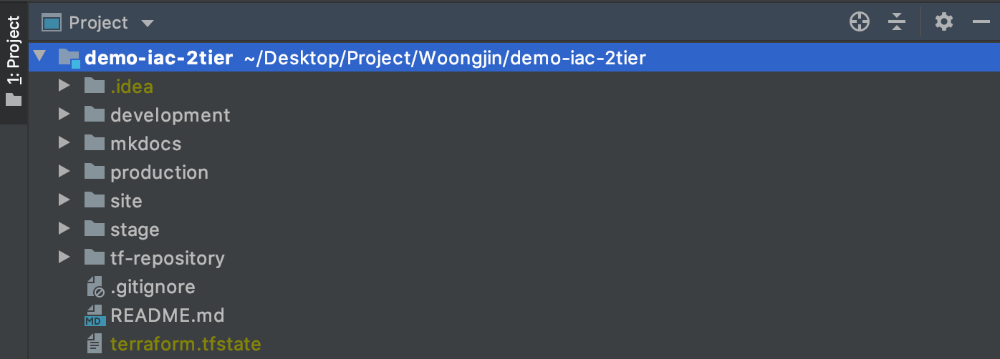

## **Directory** 
#### 웅진 프로젝트 중, demo-iac-2tier의 디렉토리 구조입니다.

---
### **1. development**
> development 환경 인프라입니다.  
>
### **2. mkdocs**
> 매뉴얼 가이드 폴더  
> mkdocs 마크다운 방식으로 글쓰기를 하며, `mkdocs serve`라는 명령어를 통해서 실시간으로 매뉴얼 내역을 확인할 수 있습니다. ([mkdocs.org](https://www.mkdocs.org) 참고)  
>
### **3. production** 
> production 환경 인프라입니다.   
>
### **4. site**
> 웅진 프로젝트의 아키텍처 명세서 및 설계 문서가 존재합니다.  
>
### **5. stage**
> stage 환경 인프라입니다.  
>
### **6. tf-repository**
> AWS db, storage 등의 repository 인프라입니다.  