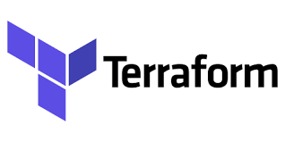
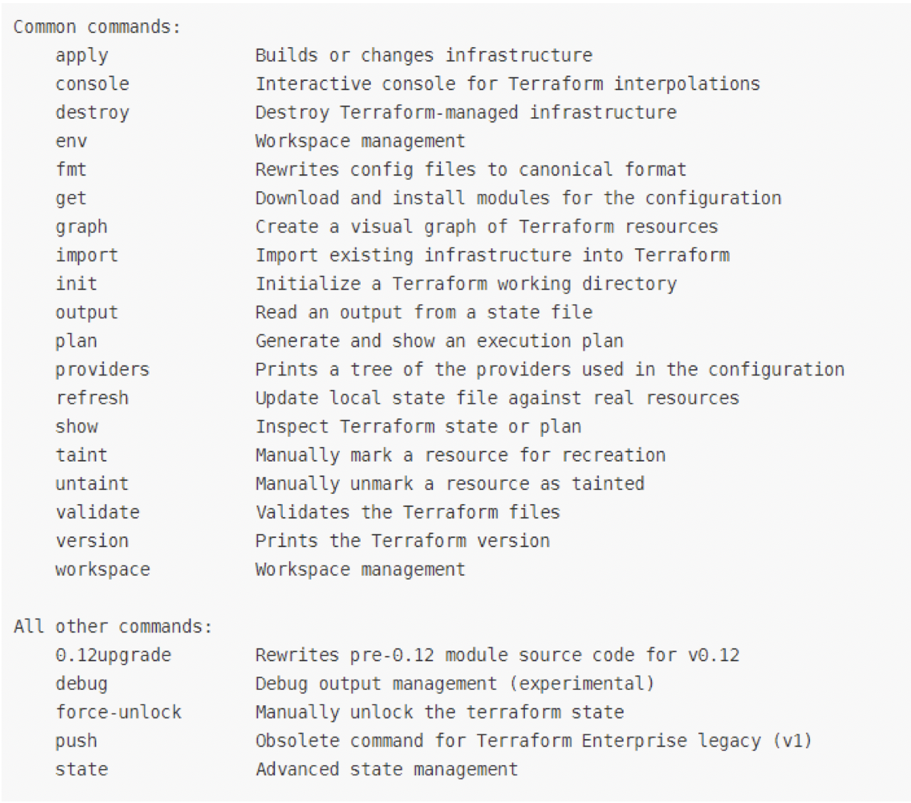
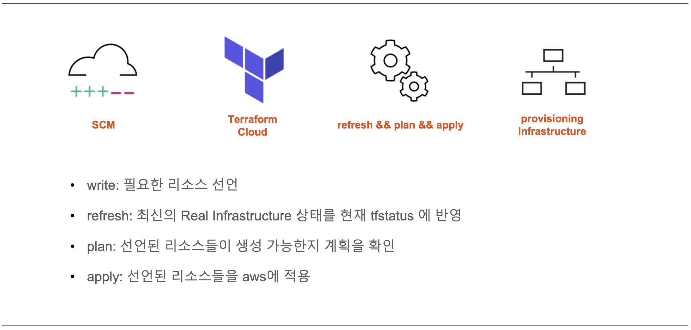

## Terraform 공유
---
### 1. Terraform 소개

> `Hashicorp`에서 오픈소스로 제공하는 인프라 레벨의 deployment를 자동화할 수 있는 `IaC`의 한 종류
>> **IaC (Infrastructure as a Code)**  
>> 인프라를 코드로 표현, 명시적인 코드 형태로 인프라를 프로비저닝하고 관리하는 방식  
>> IaC로 인프라 리소스 구성을 자동화하였을 때, 빠르고 안전하게 리소스를 증설하거나 복구 가능  
>> 문서화와 버전 관리가 수월하여 변경 이력 및 서비스 영향에 대해 명확한 파악이 가능  
>
>
### 2. Terraform 특징 
> 특정 클라우드 플랫폼에 종속되지 않고, `멀티 클라우드 환경(AWS, AZURE, GCP 등)`에서 사용 가능  
> 다른 코드처럼 git 등을 이용하여 리얼 인프라 적용 전 **사전 테스트 가능**  
> HCL 문법을 사용하여 인프라 구성을 안전하고 **예측한 대로 생성, 변경 및 프로비저닝 가능**
>
>
### 3. Terraform 주요 명령어 

>
>
### 4. Terraform 장단점
> - 장점 : 자동화 / 속도와 안전성 / 문서화 / 형상관리 / 리뷰 및 테스트 / Re use
> - 단점 : GUI 기반이 아니어서 가독성이 떨어짐 / 벤더가 최신 기술을 테라폼과 호환할 때 까지 시간이 소요 / 완전한 Toolchain 자동화를 위한 표준화와 트러블 슈팅이 필요
>
>
### 5. Terraform Workflow 
