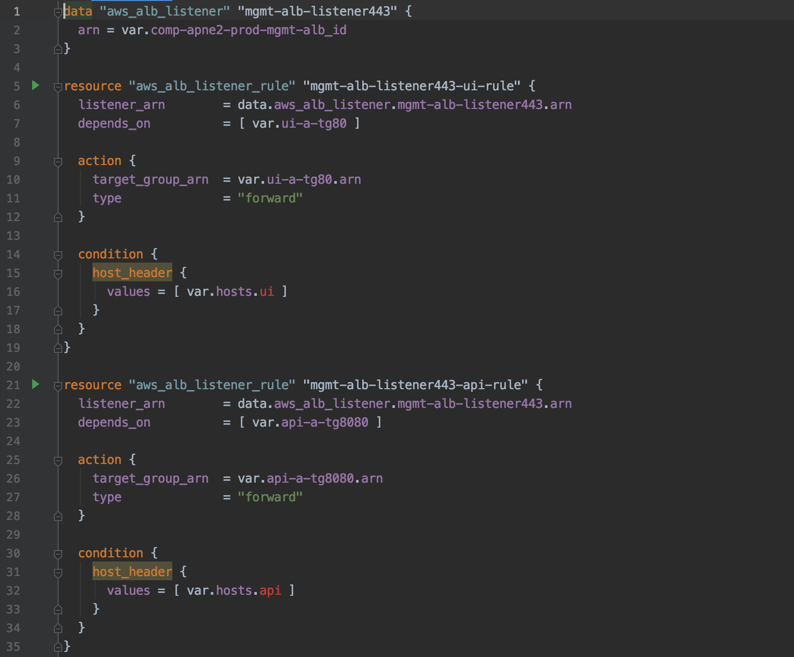

## **Module**
#### demo-iac-2tier 프로젝트에서 **공통 모듈(반드시 필요한 요소)**에 속하는 resource로, `elb`와 `vpc`가 위치합니다.
---
### 1. ALB  
> 기구축된 ALB(`comp-apne2-prod-mgmt-alb`)에, listener와 listener rule을 attach하는 형태로 구성됩니다.

>
### 2. VPC  
> 기구축된 VPC(`comp-apne2-prod-vpc`)를 data로 가져와서, demo-iac-2tier 프로젝트에서 사용하는 형태로 이루어집니다.
