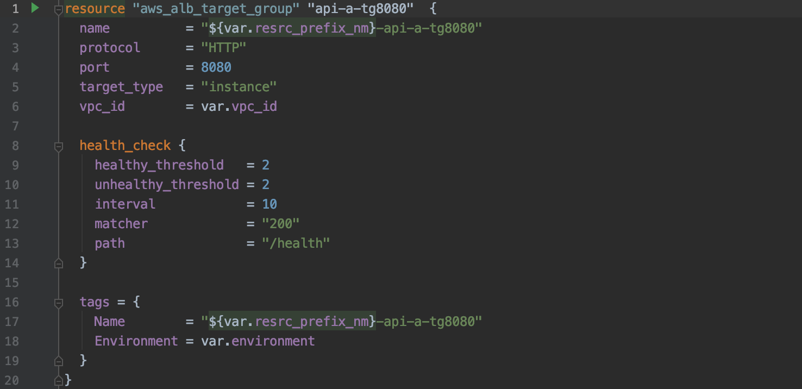
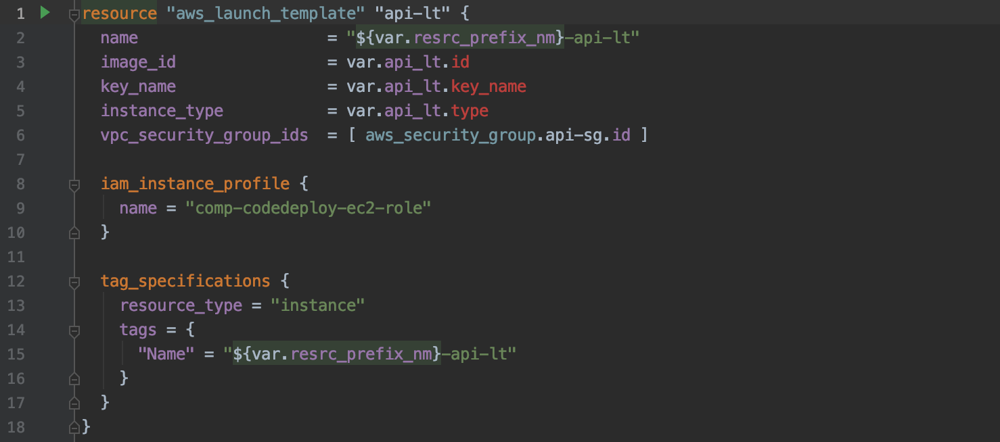
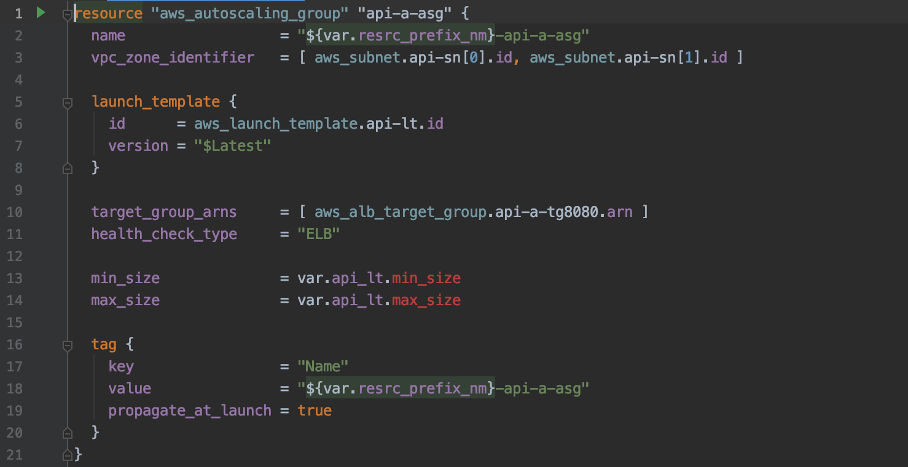
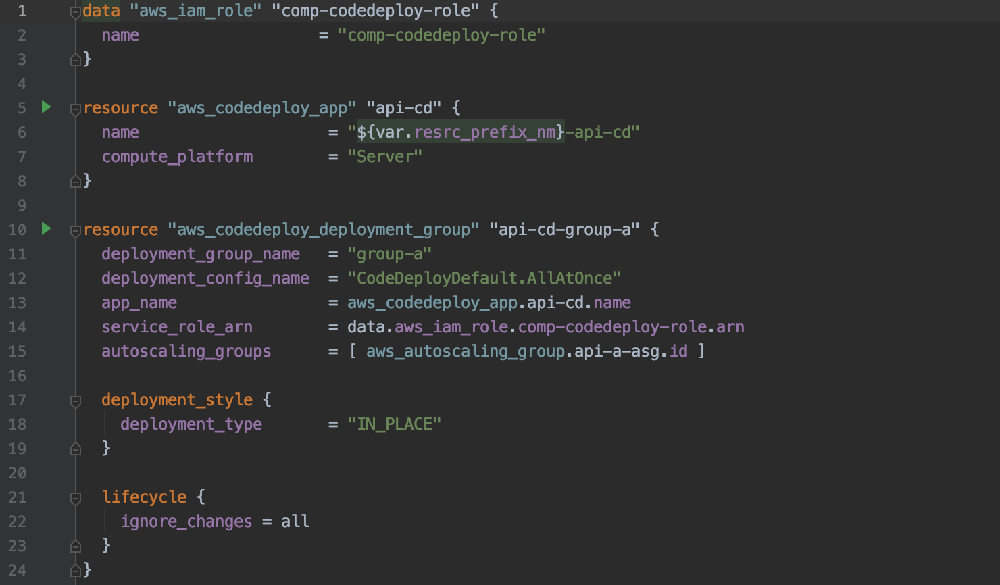

## **Services**  
##### - 2 tier service를 나타내는 `api`와 `ui`가 위치합니다.
##### - 두 서비스의 공통 인프라는 `demo` 폴더에 존재하며, 기구축한 NAT(comp-apne2-prod-nat)와 Route-Table 등의 정보로 구성되어 있습니다.
---
### 1. Target group  
> `EC2 instance`를` AutoScaling` 할 수 있는 `단위`로, Blue/Green 배포를 위해 Target Group을 2개(a, b)로 구성하였습니다.  

>  
### 2. Launch Template
> `API AMI`를 바탕으로 AutoScaling Group 구성 방법을 설정합니다.  

>
### 3. Autoscaling Group  
> `Launch Template`를 바탕으로 EC2 min/max 갯수와 health check 등을 설정합니다.  

>
### 4. Code Deploy
> `aws_codedeploy_deployment_group`에서 AutoScaling Group, Role, App을 설정합니다.
